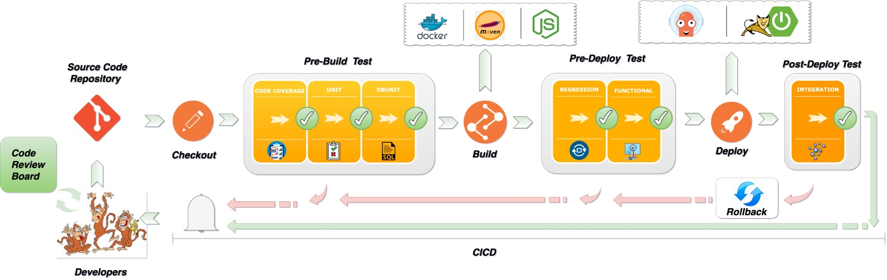

# CI/CD Setup for Demo Chat Application

This documentation provides an overview of the CI/CD setup for deploying a demo chat application to Azure Container Instances using GitHub Actions.

## Summary

This CI/CD pipeline automates the deployment of a demo chat application into Azure Container Instances (ACI). The pipeline is defined using GitHub Actions and ensures that every change to the application is tested and deployed automatically. This setup streamlines the development process, reduces manual errors, and ensures that the latest version of the application is always available.

## CICD



### Checkout
- **Purpose**: This stage checks out the code from the GitHub repository, enabling subsequent stages to access the codebase.
- **Steps**:
  - Check out the GitHub repository using the `actions/checkout@main` action.

### PreBuild-Test
- **Purpose**: This stage runs pre-build tests to ensure the codebase is ready for the build process.
- **Steps**:
  - Check out the GitHub repository.
  - Run pre-build tests to validate the codebase.

### Build
- **Purpose**: This stage builds the Docker image for the chat application and pushes it to the Azure Container Registry.
- **Steps**:
  - Check out the GitHub repository.
  - Login to Azure Container Registry using Azure CLI.
  - Build the Docker image and tag it with the GitHub commit SHA.
  - Push the Docker image to the Azure Container Registry.

### PreDeploy-Test
- **Purpose**: This stage runs pre-deploy tests to ensure the Docker image is ready for deployment.
- **Steps**:
  - Check out the GitHub repository.
  - Run pre-deploy tests to validate the Docker image.

### Deploy
- **Purpose**: This stage deploys the Docker image to Azure Container Instances (ACI).
- **Steps**:
  - Check out the GitHub repository.
  - Login to Azure Container Registry using Azure CLI.
  - Deploy the Docker image to Azure Container Instances.

### PostDeploy-Test
- **Purpose**: This stage runs post-deploy tests to validate the deployed application.
- **Steps**:
  - Check out the GitHub repository.
  - Run post-deploy tests to validate the deployed application.


## Setup

### Prerequisites

1. **Azure Account:** Ensure you have an Azure account.
2. **Azure Container Registry (ACR):** Set up an ACR to store your Docker images.
3. **Azure Service Principal:** Create a service principal with sufficient permissions to deploy to ACI.
4. **GitHub Repository:** Ensure your code is in a GitHub repository.

### GitHub Actions Configuration

Create a GitHub Actions workflow file in your repository (e.g., `.github/workflows/deploy.yml`) with the following configuration:

```yaml
on: [push]
name: ChatApp CICD

jobs:
  Checkout:
    runs-on: ubuntu-latest
    steps:
      - name: 'Checkout GitHub Action'
        uses: actions/checkout@main

  PreBuild-Test:
    runs-on: ubuntu-latest
    needs: Checkout
    steps:
      - name: 'Checkout Repository'
        uses: actions/checkout@main
      - name: 'Run Pre-Build Tests'
        run: |
          echo "Running pre-build tests..."
          # Replace with actual test commands
          echo "Tests completed."

  Build:
    runs-on: ubuntu-latest
    needs: PreBuild-Test
    steps:
      - name: 'Checkout Repository'
        uses: actions/checkout@main
      - name: 'Login via Azure CLI'
        uses: azure/login@v1
        with:
          creds: ${{ secrets.AZURE_CREDENTIALS }}
      - name: 'Build and push image'
        uses: azure/docker-login@v1
        with:
          login-server: ${{ secrets.REGISTRY_LOGIN_SERVER }}
          username: ${{ secrets.REGISTRY_USERNAME }}
          password: ${{ secrets.REGISTRY_PASSWORD }}
      - run: |
          docker build . -t ${{ secrets.REGISTRY_LOGIN_SERVER }}/chatapp:${{ github.sha }}
          docker push ${{ secrets.REGISTRY_LOGIN_SERVER }}/chatapp:${{ github.sha }}

  PreDeploy-Test:
    runs-on: ubuntu-latest
    needs: Build
    steps:
      - name: 'Checkout Repository'
        uses: actions/checkout@main
      - name: 'Run Pre-Deploy Tests'
        run: |
          echo "Running pre-deploy tests..."
          # Replace with actual test commands
          echo "Tests completed."

  Deploy:
    runs-on: ubuntu-latest
    needs: PreDeploy-Test
    steps:
      - name: 'Checkout Repository'
        uses: actions/checkout@main
      - name: 'Login via Azure CLI'
        uses: azure/login@v1
        with:
          creds: ${{ secrets.AZURE_CREDENTIALS }}
      - name: 'Deploy to Azure Container Instances'
        uses: 'azure/aci-deploy@v1'
        with:
          resource-group: ${{ secrets.RESOURCE_GROUP }}
          dns-name-label: ${{ secrets.RESOURCE_GROUP }}
          image: ${{ secrets.REGISTRY_LOGIN_SERVER }}/chatapp:${{ github.sha }}
          registry-login-server: ${{ secrets.REGISTRY_LOGIN_SERVER }}
          registry-username: ${{ secrets.REGISTRY_USERNAME }}
          registry-password: ${{ secrets.REGISTRY_PASSWORD }}
          name: aci-chatapp
          location: 'east us'

  PostDeploy-Test:
    runs-on: ubuntu-latest
    needs: Deploy
    steps:
      - name: 'Checkout Repository'
        uses: actions/checkout@main
      - name: 'Run Post-Deploy Tests'
        run: |
          echo "Running post-deploy tests..."
          # Replace with actual test commands
          echo "Tests completed."

```

## Secrets

Ensure you add the following secrets to your GitHub repository under `Settings > Secrets and variables > Actions`:

- `AZURE_CONTAINER_REGISTRY_LOGIN_SERVER`
- `AZURE_CONTAINER_REGISTRY_USERNAME`
- `AZURE_CONTAINER_REGISTRY_PASSWORD`
- `AZURE_RESOURCE_GROUP`
- `AZURE_LOCATION`

## Demo Link

You can access the deployed demo chat application using the following link:

[Demo Chat Application](http://groupa4project-chatapp.eastus.azurecontainer.io/)


## Flow

1. **Code Push:** When code is pushed to the `main` branch, the GitHub Actions workflow is triggered.
2. **Checkout Code:** The workflow checks out the latest code from the repository.
3. **Set Up Docker Buildx:** The workflow sets up Docker Buildx for building multi-platform Docker images.
4. **Login to ACR:** The workflow logs in to the Azure Container Registry using the provided credentials.
5. **Build and Push Image:** The workflow builds the Docker image for the chat application and pushes it to the Azure Container Registry.
6. **Deploy to ACI:** The workflow deploys the Docker image from ACR to Azure Container Instances.

## How to Test

1. **Push Code Changes:** Make changes to your code and push them to the `main` branch.
2. **Monitor GitHub Actions:** Check the Actions tab in your GitHub repository to monitor the progress of the workflow.
3. **Access the Application:** Once the deployment is complete, access the demo chat application using the demo link provided above.
4. **Verify Deployment:** Ensure that the application is running as expected by interacting with the chat interface.

By following these steps, you can ensure that your demo chat application is continuously tested and deployed to Azure Container Instances efficiently.
